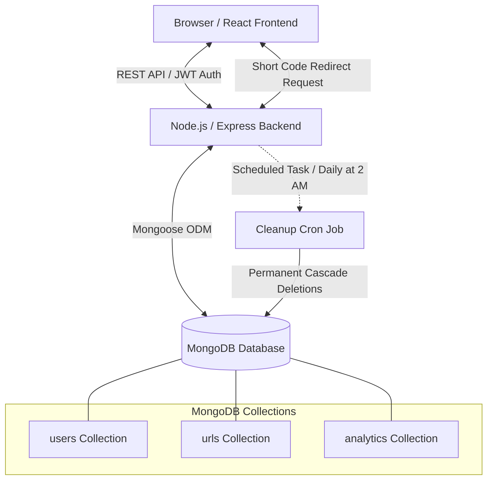

# ShortLQ - URL Shortener with Analytics 🔗

A full-stack URL Shortener application built with **React, Node.js, Express, and MongoDB**, featuring user authentication, real-time analytics tracking, customizable link expiry, and a premium interactive WebGL water-ripple glassmorphism user interface.

This project is designed to be highly responsive, modern, and engaging. It includes random background image selections on every page load with interactive water distortion physics that react dynamically to cursor movement.

---

## 🎨 Interactive Visual Experience

### 🌊 WebGL Water Ripple & Random Backgrounds
The application utilizes an interactive WebGL-based water ripple distortion effect.
- **Dynamic Physics**: When a user moves their mouse over any page, realistic water ripples follow the cursor.
- **Randomized Themes**: Every time the application is loaded, the frontend randomly selects one of 6 high-definition background images (`img1.jpg` to `img6.jpg`) located in `frontend/public/bg/`, offering a unique aesthetic experience on every visit while keeping the water simulation intact.

### 🌟 Premium Glassmorphism UI
- Frosted glass cards with high-contrast elements, neon glowing gradients, and clean layout cards.
- Custom particle trail cursors that track mouse movement.
- Fully responsive styling optimized for mobile, tablet, and desktop layouts.

---

## 🧠 AI Planning & Architecture Document

### 1. Development Process & Workflow
The development followed a modular, structured AI pair-programming workflow:
1. **Requirements Analysis & Planning**: Mapping the hackathon requirements, user specifications, and technical constraints.
2. **Database Modeling**: Planning schemas for User authentication, URLs, and Analytics event tracking, adding index optimizations.
3. **Core API Backend**: Establishing REST API endpoints for user authentication, URL shortening, redirect handlers, and analytics reporting.
4. **Interactive UI Foundation**: Creating the WebGL Canvas pool and custom CSS design system variables to style pages without generic browser presets.
5. **Dashboard & Expiry Pickers**: Developing components for managing URLs, generating instant copy actions, and implementing collapsible selection controls for custom link lifespans.
6. **Automation & Cleanup**: Building a scheduled cron system to automatically delete expired links or links left inactive for 6 months to optimize database sizing.
7. **Verification & Refinement**: Running builds, checking environment configuration safety, and wiring up permanent account deletion settings.

### 2. Application Architecture Diagram



### 3. Core Logic Workflows

#### A. Link Shortening & Expiry
```
User Inputs Long URL + Expiry Timer -> Frontend Validates URL Format -> API Requests Backend
-> Backend Generates Unique 6-8 Character Short Code
-> Backend Calculates 'expiresAt' (e.g. Current Time + 5 minutes or 6 months)
-> Saved to MongoDB
```

#### B. Redirection & Expiry Check
```
Visitor Clicks shortiq.io/abc123 -> Express Route Handles GET /:shortCode
-> Queries URL in MongoDB
-> IF isExpired === true OR (expiresAt exists AND expiresAt < now):
     Returns 410 Gone Error page / Informs Visitor Link has expired
-> ELSE:
     Increments total clicks count in background
     Logs new Analytics event (timestamp, user agent, IP)
     Returns HTTP 302 Redirect to the original long destination URL
```

#### C. Daily Database Cleanup Cron Job
Runs automatically every day at **2:00 AM** to free database storage:
- **Expired Links**: Searches for URLs where `expiresAt < now`.
- **Inactive Links**: Searches for URLs where `lastVisited` is older than 6 months, or if never visited, `createdAt` is older than 6 months.
- **Cascade Deletion**: Permanently deletes these URL documents and their corresponding click analytics entries to maintain high performance.

#### D. Permanent Account Self-Deletion
Available directly in the **Account Settings** modal:
- User clicks "Settings" in the authenticated Navbar.
- Enters password and types `DELETE` to verify intent.
- Backend deletes the User document, and automatically cascade-deletes all associated URLs and their analytics data.

---

## 🎯 Features Checklist

### Mandatory Features ✅
- **Authentication**:
  - [x] Secure user signup and login with hashed passwords.
  - [x] JWT-based authorization with protected route guards.
  - [x] Strict user ownership (users can only view/delete their own links).
- **URL Shortening**:
  - [x] Input validation (supports only valid URLs starting with `http://` or `https://`).
  - [x] Automatic unique 6-8 character short code generation.
  - [x] Server-side redirection with analytics tracking.
- **User Dashboard**:
  - [x] Clean, responsive, full-grid layout.
  - [x] Table/Cards showing original URL, short URL, created date, and total clicks.
  - [x] Easy copy-to-clipboard action button.
  - [x] Quick delete button for URLs.
- **Analytics Details**:
  - [x] Tracks total click counts per URL.
  - [x] Records visit timestamps, IP addresses, referrers, and user agents.
  - [x] Detailed stats page displaying total clicks, last visited timestamp, and full chronological visit history list.

### Advanced Bonus Features 🎁
- [x] **Custom Link Expiry**: Options from 5 minutes, 1 hour, 1 day, 7 days, 1 month, 3 months, 6 months, to "Never".
- [x] **Automated DB Cleanup**: Background cron schedule cleaning inactive and expired links.
- [x] **Interactive WebGL Visuals**: Live water ripple animation running on custom fragment shaders.
- [x] **Randomized Themes**: Dynamically chooses background image assets on every load.
- [x] **Permanent Cascade Account Deletion**: Self-service security dashboard allowing full user data wipe.

---

## 📊 Database Schema Details

### User Collection (`users`)
```javascript
{
  _id: ObjectId,
  email: String,       // Unique, normalized index
  password: String,    // Hashed with bcrypt (10 rounds)
  createdAt: Date
}
```

### URL Collection (`urls`)
```javascript
{
  _id: ObjectId,
  userId: ObjectId,      // Reference -> User._id (indexed)
  originalUrl: String,
  shortCode: String,     // Unique alphanumeric key (indexed)
  createdAt: Date,
  clicks: Number,
  lastVisited: Date,
  expiresAt: Date,       // Optional, user-defined limit
  isExpired: Boolean     // Quick redirect validation flag
}
```

### Analytics Collection (`analytics`)
```javascript
{
  _id: ObjectId,
  urlId: ObjectId,      // Reference -> URL._id (indexed, cascade deleted)
  timestamp: Date,
  userAgent: String,
  referer: String,
  ipAddress: String
}
```

---

## 🚀 Setup & Installation Instructions

### Prerequisites
- **Node.js** (v16.x or higher)
- **MongoDB** (running locally on default port 27017 or a MongoDB Atlas cloud URI)
- **npm** or **yarn** package manager

### 1. Clone & Project Initialization
```bash
git clone https://github.com/sarthar3/ShortLQ.git
cd ShortLQ
```

### 2. Backend Environment & Run
1. Navigate to the backend directory:
   ```bash
   cd backend
   ```
2. Install dependecies:
   ```bash
   npm install
   ```
3. Create a `.env` file by copying the example:
   ```bash
   cp .env.example .env
   ```
4. Define your config variables in `.env`:
   ```env
   PORT=5000
   MONGODB_URI=mongodb://localhost:27017/shortlq
   JWT_SECRET=your_super_secret_jwt_signature_key
   NODE_ENV=development
   FRONTEND_URL=http://localhost:5173
   ```
5. Start the backend development server:
   ```bash
   npm run dev
   ```
   *The server runs on `http://localhost:5000`.*

### 3. Frontend Environment & Run
1. Open a new terminal and navigate to the frontend directory:
   ```bash
   cd ../frontend
   ```
2. Install dependencies:
   ```bash
   npm install
   ```
3. Create a `.env` file by copying the example:
   ```bash
   cp .env.example .env
   ```
4. Configure the API endpoint in `.env`:
   ```env
   VITE_API_URL=http://localhost:5000
   ```
5. Start the frontend development server:
   ```bash
   npm run dev
   ```
   *The application will open on `http://localhost:5173`.*

---

## 📝 Assumptions Made
1. Users will input valid URLs with protocol headers (`http://` or `https://`). If omitted, the app validation flags an instruction to include the protocol.
2. Short codes should remain simple and alphanumeric for readability.
3. Once an account is deleted, the cascade behavior permanently cleans all tracking records to preserve database space. No backup soft-deleting exists.
4. Database cleanups run daily at 2:00 AM, using the server host's local timezone.

---

## 🎥 Walkthrough Video Demo

https://youtu.be/88dAz-sRD54?si=e5CMzxG8lwt41CnT

## Website Live at

https://shortlq.netlify.app/

---

**This project is a part of a hackathon run by https://katomaran.com**
